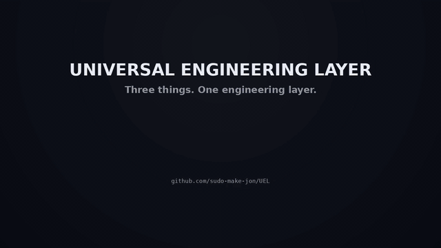

# Universal Engineering Layer

**One engineering layer for AI-assisted software development: skills, capabilities, and an agentic companion that knows what to use when.**

A portable engineering environment and automated Engineering Companion for AI coding agents.

Universal Engineering Layer gives a software project one shared engineering policy, one shared skill set, one shared tool hierarchy, an automated **Engineering Companion** meta-skill, and lightweight adapters for multiple AI coding harnesses.

It is designed for projects that may be worked on with different agents over time:

- OpenAI Codex
- Claude Code
- Google Antigravity
- Hermes Agent
- VS Code / GitHub Copilot
- OpenCode
- OpenClaw
- other compatible coding agents

Instead of maintaining separate engineering instructions for every harness, the project keeps one canonical source of truth.

---


# What Universal Engineering Layer does

Universal Engineering Layer gives a software project a consistent, reusable
AI engineering environment across coding agents, IDEs, and harnesses.

It does **three things for you**:

## 1. Installs a proven engineering skill stack

Universal Engineering Layer brings in and organizes two complementary
engineering skill systems:

- **Karpathy Guidelines** as the always-on engineering discipline and behavior
  baseline;
- **Matt Pocock's engineering skills** as task-specific workflows for moments
  such as requirements clarification, specification, implementation, TDD,
  debugging, review, and planning.

The result is not just a collection of prompts. It gives compatible agents a
shared way to think about engineering quality, scope, risk, and execution.

## 2. Adds an engineering capability layer

Universal Engineering Layer can install or configure supporting engineering
tools and MCP capabilities that make agents materially better at understanding
and verifying real software projects.

Depending on the selected profile, this can include:

- `codebase-memory-mcp` for persistent code intelligence and repository
  understanding;
- Context7 guidance for current framework and library documentation;
- `ast-grep` for structural code search and transformation;
- `ripgrep`, `fd`, `jq`, and `yq` for fast repository and data inspection;
- Playwright MCP guidance for browser and runtime verification;
- GitHub MCP guidance for issues, pull requests, CI, and remote repository
  context.

The goal is to give agents the right **capabilities**, not merely more text
instructions.

## 3. Provides a true agentic Engineering Companion

Universal Engineering Layer includes the **Engineering Companion**, a
meta-skill that helps the user and the AI navigate the entire engineering
environment.

It identifies the current engineering moment, evaluates risk, inspects the
skills actually installed in the project, and recommends the most appropriate
next workflow, skill, tool, or sequence of skills.

For example, when the installed skill set supports it:

```text
Vague feature idea
→ /grill-me
→ /to-spec

Defined implementation
→ /implement

Bug investigation
→ /triage
→ /tdd
→ /implement

Completed change
→ /code-review
```

The companion uses a generated installed-skill registry:

```text
.agents/SKILL_REGISTRY.json
```

so it recommends **real installed skills by exact name** rather than generic or
invented commands.

In short:

```text
Universal Engineering Layer
        │
        ├── 1. Engineering discipline + workflows
        │      Karpathy + Matt Pocock skills
        │
        ├── 2. Engineering capabilities
        │      MCPs + CLI tooling + verification tools
        │
        └── 3. Engineering orchestration
               Engineering Companion meta-skill
               → detects the moment
               → selects the skill
               → selects the tools
               → recommends the next engineering move
```

The result is a portable engineering layer that lets different AI coding tools
work under the same engineering process.

---


## See UEL in action



_This full-length animated GIF is the complete visual walkthrough._

The walkthrough shows how UEL:

- installs the Karpathy engineering baseline and Matt Pocock workflow skills;
- adds engineering capabilities and MCP/tooling guidance;
- uses `/engineering-companion` to detect the current engineering moment;
- routes to exact installed skills such as `/grill-me`, `/to-spec`, `/tdd`, and `/code-review`;
- recommends short, ordered workflows based on the task and project state.
---

# Choose how you want to install it

Universal Engineering Layer can be used in **two clearly different ways**:

1. **Install the CLI globally on your system**
2. **Install the engineering layer only inside one project**

These are not the same thing.

---

## Option A — Install globally on your system

Use this if you want a reusable command such as:

```bash
engineering-layer
```

available from any terminal.

This installs the **launcher script globally**, but the engineering layer itself
is still installed into projects only when you explicitly run it there.

### Global CLI setup

Clone this repository:

```bash
git clone https://github.com/sudo-make-jon/UEL.git
cd universal-engineering-layer
```

Install the script into a directory on your `PATH`:

```bash
mkdir -p ~/bin
cp universal-engineering-layer.sh ~/bin/engineering-layer
chmod +x ~/bin/engineering-layer
```

Make sure `~/bin` is on your `PATH`.

For Bash:

```bash
echo 'export PATH="$HOME/bin:$PATH"' >> ~/.bashrc
source ~/.bashrc
```

For Zsh:

```bash
echo 'export PATH="$HOME/bin:$PATH"' >> ~/.zshrc
source ~/.zshrc
```

Now you can enter any project and install the layer:

```bash
cd ~/projects/my-project

engineering-layer install --profile recommended
```

And later:

```bash
engineering-layer companion
engineering-layer doctor
engineering-layer update --profile recommended
```

### What global installation changes

The global setup above creates:

```text
~/bin/engineering-layer
```

It does **not** automatically modify all your projects.

Each project receives the engineering layer only when you run:

```bash
engineering-layer install
```

inside that project or point to it with:

```bash
engineering-layer install --project /path/to/project
```

### Hermes note

If Hermes is detected, the installer may register the project's skill directory
inside the user's Hermes configuration.

If you do **not** want that user-level Hermes change, add:

```bash
--no-hermes-config
```

Example:

```bash
engineering-layer install \
  --profile recommended \
  --no-hermes-config
```

---

## Option B — Install only inside one project

Use this if you want **everything to stay project-local** and do not want to
install a global `engineering-layer` command.

Go to the target project:

```bash
cd /path/to/my-project
```

Download the installer directly into that project:

```bash
curl -fL -o universal-engineering-layer.sh https://raw.githubusercontent.com/sudo-make-jon/UEL/main/universal-engineering-layer.sh
```


Before running the installer, verify that you downloaded a shell script rather
than an HTTP error page:

```bash
head -n 3 universal-engineering-layer.sh
```

The first line should be:

```bash
#!/usr/bin/env bash
```

Because the download command uses `curl -f`, HTTP errors such as `404 Not Found`
will now cause `curl` to fail instead of writing the error response into
`universal-engineering-layer.sh`.

Make it executable:

```bash
chmod +x universal-engineering-layer.sh
```

Then install the engineering layer locally:

```bash
./universal-engineering-layer.sh install \
  --profile recommended \
  --no-hermes-config
```

This is the recommended command for a **strictly project-local installation**.

### What project-local installation changes

It adds project files such as:

```text
my-project/
├── AGENTS.md
├── CLAUDE.md
├── CONTEXT.md
├── ENGINEERS.md
├── how-to.html
├── universal-engineering-layer.sh
│
├── .agents/
├── .claude/
├── .codex/
├── .opencode/
├── .openclaw/
└── .github/
```

The `how-to.html` file is generated locally and automatically added to
`.gitignore`.

The project-local install does **not** require a global CLI.

### Project-local commands

From inside the project:

```bash
./universal-engineering-layer.sh companion
```

```bash
./universal-engineering-layer.sh doctor
```

```bash
./universal-engineering-layer.sh update --profile recommended
```

```bash
./universal-engineering-layer.sh remove
```

### Claude Code in a project-local install

Inside Claude Code, use:

```text
/engineering-companion
```

For example:

```text
/engineering-companion what should I do next?
```

This is different from the shell command:

```bash
./universal-engineering-layer.sh companion
```

The slash-command skill can use the active conversation and harness context,
while the shell command performs lightweight repository-state analysis.

### Strict project-local rule

If you want the installation to remain strictly local to the project, use:

```bash
--no-hermes-config
```

because Hermes integration may otherwise write to:

```text
~/.hermes/config.yaml
```

---

# Quick decision guide

| What you want | Recommended setup |
|---|---|
| Use UEL across many projects | Install the CLI globally as `engineering-layer` |
| Use UEL in only one repository | Keep `universal-engineering-layer.sh` inside that project |
| Absolutely no user-level config changes | Use project-local install + `--no-hermes-config` |
| Use Claude Code skill directly | `/engineering-companion` |
| Ask from a normal terminal | `engineering-layer companion` or `./universal-engineering-layer.sh companion` |
| Maintain multiple projects easily | Global CLI install |

A useful mental shortcut:

```text
GLOBAL INSTALL
→ installs the reusable launcher command on your system

PROJECT INSTALL
→ installs the engineering layer into a repository
```

The launcher and the project layer are separate concepts.

---

# What problem does it solve?

AI coding harnesses do not all use the same instruction or skill format.

A project can easily end up with duplicated instructions such as:

```text
.claude/skills/
.codex/skills/
.hermes/skills/
.antigravity/skills/
```

Those copies eventually drift apart.

Universal Engineering Layer instead creates:

```text
.agents/
├── ENGINEERING.md
├── SKILLS.md
├── skills/
├── rules/
├── mcp/
└── adr/
```

and then exposes that same engineering environment to each harness.

The key rule is:

```text
ONE ENGINEERING LAYER
MULTIPLE AI HARNESS ADAPTERS
```

---

# The architecture

The environment is split into three deliberately separate layers.

## 1. Engineering behavior

The **Karpathy Guidelines** define the default engineering discipline.

They answer:

> How should the coding agent behave while doing engineering work?

Examples include:

- understand before editing;
- prefer small and surgical changes;
- avoid unnecessary abstractions;
- make important assumptions explicit;
- preserve existing behavior unless change is required;
- verify the result;
- never claim tests or validation were performed when they were not.

The canonical baseline is:

```text
.agents/skills/karpathy-guidelines/SKILL.md
```

---

## 2. Engineering workflows

**Matt Pocock Skills** provide task-specific workflows.

They answer:

> Which process should the agent follow for this kind of engineering task?

Depending on the current upstream skill repository, workflows may cover areas such as:

- specification
- implementation
- TDD
- code review
- prototyping
- triage
- tickets
- documentation
- repository exploration
- requirement clarification

Available skills are indexed in:

```text
.agents/SKILLS.md
```

---

## 3. Engineering capabilities

Optional tools give the agent additional capabilities.

These include:

- codebase-memory-mcp
- Context7
- ast-grep
- ripgrep
- fd
- jq
- yq
- Playwright
- GitHub MCP

These tools **do not replace** Karpathy or Pocock.

The relationship is:

```text
Karpathy
    ↓
Engineering behavior

Matt Pocock Skills
    ↓
Engineering workflow

MCPs + CLI engineering tools
    ↓
Engineering capabilities
```

Together:

```text
Human request
   ↓
Project instructions
   ↓
Karpathy baseline
   ↓
Relevant Pocock workflow
   ↓
Code intelligence / external knowledge
   ↓
Implementation
   ↓
Tests / build / runtime verification
   ↓
Git / GitHub collaboration
```

---

# ENGINEERS.md

Universal Engineering Layer creates:

```text
ENGINEERS.md
```

This is one of the most important files in the environment.

`ENGINEERS.md` explains to both humans and AI agents:

- what each engineering tool is for;
- when an MCP should be used;
- which tools overlap;
- which tool should be preferred first;
- how codebase memory should interact with AST search and text search;
- how external documentation should be queried;
- how testing and browser verification should be prioritized;
- how Git and GitHub MCP should divide responsibilities.

This prevents a common agent problem: having five different tools that can search code and using them randomly.

The recommended hierarchy is documented directly in `ENGINEERS.md`.

---

# Local interactive tutorial (`how-to.html`)

Every installation now generates:

```text
how-to.html
```

next to:

```text
ENGINEERS.md
```

The file is a polished, self-contained local tutorial that explains:

- the Karpathy baseline;
- the Matt Pocock skill layer;
- the Engineering Companion meta-skill;
- project moments;
- skill/tool routing;
- codebase-memory, Context7, ast-grep, Playwright, and GitHub MCP roles;
- install profiles;
- the recommended engineering workflow;
- useful CLI commands.

The installer automatically adds:

```text
how-to.html
```

to the target project's `.gitignore`.

That makes the tutorial available locally to each developer without adding a generated file to the repository history.

Open it directly in a browser after installation:

```bash
xdg-open how-to.html
```

or on macOS:

```bash
open how-to.html
```

The tutorial is branded:

```text
Made by @sudo-make-jon
```

---

# Preferred engineering-tool hierarchy

## Understanding your own codebase

Preferred order:

```text
1. codebase-memory-mcp / LSP
2. ast-grep
3. ripgrep
4. manual file traversal
```

### codebase-memory-mcp

Best for:

- architectural understanding;
- persistent repository indexing;
- callers and callees;
- dependency chains;
- impact analysis;
- semantic code search;
- route and service relationships.

### ast-grep

Best for:

- structural search;
- syntax-aware matching;
- AST-based refactoring;
- precise transformations.

### ripgrep

Best for:

- exact strings;
- comments;
- configuration values;
- textual fallback searches.

---

# External library knowledge

Preferred order:

```text
1. Context7
2. official documentation
3. general web search
```

Context7 is intended for external libraries and frameworks.

Example:

```text
Your repository
    ↓
codebase-memory-mcp

Next.js / React / FastAPI docs
    ↓
Context7
```

Do not use Context7 as a replacement for understanding your own repository.

---

# Verification hierarchy

Preferred order:

```text
1. project tests
2. typecheck
3. lint
4. build
5. Playwright / runtime browser verification
```

Playwright is particularly valuable for:

- web applications;
- user journeys;
- regressions;
- authentication flows;
- forms;
- UI behavior;
- end-to-end validation.

---

# Git and GitHub MCP

Use:

```text
local Git
```

for:

- diffs;
- branches;
- commits;
- local repository state.

Use:

```text
GitHub MCP
```

for:

- issues;
- pull requests;
- CI / Actions;
- code review context;
- repository metadata;
- Dependabot;
- code-security information.

Read-only GitHub access is recommended by default.

Write access should be explicitly enabled only when needed.

---

# Engineering Companion

Universal Engineering Layer v3 adds an orchestration/meta-skill:

```text
.agents/skills/engineering-companion/
├── SKILL.md
├── references/
│   ├── project-moments.md
│   ├── skill-routing.md
│   ├── tool-routing.md
│   └── risk-levels.md
└── scripts/
    └── project-state.sh
```

The Engineering Companion turns the layer from a static collection of skills
into an **active engineering workflow router**.

Its job is to answer:

> Given what the user is trying to do and the current state of the repository,
> what engineering workflow should happen next?

It does not replace Karpathy or Matt Pocock skills.

Instead:

```text
Karpathy Guidelines
    ↓
Engineering behavior

Engineering Companion
    ↓
Project-moment detection + routing

Matt Pocock Skills
    ↓
Task-specific workflows

MCPs / CLI tools
    ↓
Engineering capabilities
```

## Project moments

The companion recognizes moments such as:

```text
idea
discovery
specification
planning
implementation
debugging
refactoring
testing
review
integration
pre-commit
pull-request
release
production-incident
maintenance
```

For example:

```text
User:
"This function is used everywhere and I need to change its API."

Companion:
moment = refactoring
risk = high

Recommended:
1. codebase-memory/LSP impact analysis
2. relevant ADR/context review
3. tests before modification
4. implementation/refactor workflow
5. ast-grep for structural changes
6. regression verification
```

Another example:

```text
User:
"I implemented the form but I'm not sure it works."

Companion:
moment = testing / review

Recommended:
1. project tests
2. typecheck/lint/build
3. Playwright for user-facing behavior
4. code-review skill
```

## Proactive behavior

The companion is designed to help without becoming noisy.

Guidance built into the skill:

```text
low confidence
→ stay quiet

medium confidence
→ briefly suggest the most useful next workflow

high confidence
→ load/apply the relevant skill automatically when the harness supports it
  and doing so would not create surprising side effects
```

This allows a compatible harness or IDE to behave more like an engineering
partner rather than a passive toolbox.

## Companion CLI

After the layer is installed, you can ask the repository-state detector what
it thinks the next engineering step should be:

```bash
./universal-engineering-layer.sh companion
```

or, when installed globally:

```bash
engineering-layer companion
```

Example output:

```text
Universal Engineering Companion
Project: /home/user/projects/example

project_type: javascript/typescript
git: true
branch: feature/auth-refresh
dirty: true
changed_files: 8
staged_files: 0
tests_detected: true
moment: implementation
risk: medium

recommended_skill: implementation
recommended_tools: codebase-memory for impact; Context7 for external APIs; ast-grep for structural changes
verification: focused tests, then typecheck/lint/build as applicable
```

The CLI detector is intentionally lightweight and local. It examines signals
such as:

- Git branch;
- working-tree state;
- staged changes;
- number of changed files;
- test directories;
- CI presence;
- project manifests;
- sensitive changed paths such as authentication, schema, migrations,
  security, infrastructure, or deployment files.

The **skill itself** can reason over much richer context because the active
harness may also have access to the user's request, MCP tools, LSP, GitHub,
CI, codebase-memory, and project documentation.

## Asking the companion directly

In a skill-aware harness, prompts such as:

```text
What should I do next?
```

or:

```text
Use the engineering companion to assess this change.
```

can route through:

```text
.agents/skills/engineering-companion/SKILL.md
```

The companion's recommended response structure is:

```text
Current moment:
Risk:
Why:
Recommended workflow:
Recommended skill:
Recommended tools:
Verification:
```

See:

```text
docs/engineering-companion.md
```

for a focused explanation of the feature.

---


## Using the Engineering Companion inside your harness

After installation, skill-aware harnesses can expose the companion directly as:

```text
/engineering-companion
```

For example, in Claude Code:

```text
/engineering-companion what should I do next?
```

```text
/engineering-companion assess the risk of this change
```

```text
/engineering-companion which skill should I use for this bug?
```

The companion can also be selected automatically by compatible harnesses when
the task clearly calls for workflow routing.

The shell command remains available:

```bash
engineering-layer companion
```

The distinction is useful:

```text
/engineering-companion
→ understands the active user request + harness context + project state

engineering-layer companion
→ lightweight repository-state analysis from the shell
```

### Important: `how-to.html` is not a project specification

`how-to.html` is generated by Universal Engineering Layer as a **local
tutorial**.

It must not be interpreted by the Engineering Companion—or by other agents—as:

```text
a PRD
a project seed
a product specification
a requirements document
a design brief
```

The installed policies explicitly tell agents to ignore it when determining
what the user's software project is meant to become.

Project intent should instead be derived from:

1. the user's request;
2. `CONTEXT.md`;
3. actual product/project documentation;
4. ADRs;
5. source code, tests, issues, and Git history.


---


## Deterministic exact-skill routing

The Engineering Companion routes against the skills that are **actually
installed** in the project.

During installation, Universal Engineering Layer scans every installed
`SKILL.md` and generates:

```text
.agents/SKILL_REGISTRY.json
```

This registry contains exact skill names, slash commands, descriptions,
capabilities, supported project moments, and routing priorities.

That means the companion can recommend real installed Matt Pocock skills.

For example, if these are installed:

```text
/grill-me
/to-spec
/to-tickets
/implement
/tdd
/code-review
```

and the user says:

```text
I have an idea for a feature, but the requirements are still vague.
```

the companion can deterministically recommend:

```text
/grill-me
→ /to-spec
```

instead of only saying:

```text
requirements clarification
→ specification
```

A larger workflow can become:

```text
/grill-me
→ /to-spec
→ /to-tickets
→ /implement
→ /code-review
```

A debugging workflow can become:

```text
/triage
→ /tdd
→ /implement
```

when those exact skills are installed.

### Hard rules

The Engineering Companion must:

1. consult `.agents/SKILL_REGISTRY.json`;
2. prefer an exact installed slash command over a generic workflow label;
3. never invent a skill command that is absent from the registry;
4. recommend an ordered sequence when several installed skills are useful;
5. keep that sequence as short as practical;
6. re-evaluate the project moment after major workflow transitions;
7. fall back to a generic workflow description if no installed skill matches.

The deterministic resolver lives at:

```text
.agents/skills/engineering-companion/scripts/resolve-skill.py
```

Example:

```bash
python3 .agents/skills/engineering-companion/scripts/resolve-skill.py   --registry .agents/SKILL_REGISTRY.json   --moment specification   --task "I have an idea but the requirements are vague"
```


---

# Profiles

Universal Engineering Layer uses installation profiles.

---

## Minimal

```bash
./universal-engineering-layer.sh install --profile minimal
```

Installs the common engineering methodology and harness integration.

Includes:

```text
Karpathy Guidelines
Engineering Companion meta-skill
Matt Pocock Skills
ENGINEERING.md
ENGINEERS.md
SKILLS.md
CONTEXT.md template
ADR directory
Codex adapter
Claude Code adapter
Antigravity adapter
Hermes integration
VS Code / Copilot adapter
OpenCode compatibility
OpenClaw compatibility
```

It does **not** attempt to install the optional engineering capability stack.

Use this when:

- you want only the shared skills/policy layer;
- the machine is constrained;
- you prefer to manage development tools yourself.

---

## Recommended

```bash
./universal-engineering-layer.sh install --profile recommended
```

Includes everything in `minimal`, plus the recommended engineering capability layer.

The installer checks or attempts to install:

```text
codebase-memory-mcp
ast-grep
ripgrep
fd
jq
yq
```

It also prepares MCP capability documentation for:

```text
Context7
codebase-memory-mcp
```

This is the recommended profile for most development workstations.

---

## Full

```bash
./universal-engineering-layer.sh install --profile full
```

Includes the recommended profile plus guidance for:

```text
Playwright
GitHub MCP
```

The full profile is designed for highly agentic development workflows where an AI agent may:

```text
understand issue
    ↓
inspect architecture
    ↓
check current external docs
    ↓
implement
    ↓
run tests
    ↓
open application
    ↓
verify browser behavior
    ↓
inspect pull request / CI
```

---

# Why some MCPs are not configured automatically

MCP registration is not yet universal across coding harnesses.

Codex, Claude Code, Hermes, Antigravity, OpenCode, and other agents can use different configuration formats and different credential stores.

Universal Engineering Layer therefore follows an important rule:

> Project policy can be shared. Machine credentials should not be.

The installer does **not** write GitHub tokens, API keys, or secrets into your repository.

It creates capability notes under:

```text
.agents/mcp/
```

where MCP-related project guidance can live safely.

---

# codebase-memory-mcp

`codebase-memory-mcp` is the main code-intelligence addition to the recommended profile.

It complements the engineering skills extremely well.

Example:

```text
Feature request
   ↓
Karpathy:
"Understand before changing"
   ↓
Pocock workflow:
"Follow implementation/spec process"
   ↓
codebase-memory:
"Show callers, dependencies and related components"
   ↓
ast-grep:
"Find exact structural pattern"
   ↓
Implement
```

The installer uses conservative defaults when the CLI is available:

```text
auto_index = true
auto_watch = false
auto_index_limit = 20000
```

Auto-indexing is enabled because it makes project discovery far more useful.

Continuous watching is disabled by default because larger repositories can consume significant resources during indexing.

Advanced users can change those settings later.

---

# Context7

Context7 adds current third-party library and framework documentation.

This complements codebase memory rather than overlapping with it.

Think of the split as:

```text
codebase-memory-mcp
    ↓
What does MY repository do?

Context7
    ↓
How does THIS external library currently work?
```

This is especially useful for rapidly evolving frameworks and APIs.

---

# ast-grep

`ast-grep` provides syntax-aware code search and transformations.

It sits between semantic code intelligence and plain text search.

Preferred hierarchy:

```text
code graph / LSP
    ↓
ast-grep
    ↓
ripgrep
```

Use it for things such as:

- finding a specific syntax pattern;
- structural refactoring;
- matching function calls;
- code transformations that would be unsafe with regex.

---

# ripgrep and fd

These are deliberately simple tools.

They are also extremely valuable to coding agents.

### ripgrep

```bash
rg
```

Fast textual search across repositories.

### fd

```bash
fd
```

Fast path and filename discovery.

They are excellent fallbacks when semantic tooling is unnecessary.

---

# jq and yq

Useful for agent-driven configuration work.

```text
jq → JSON
yq → YAML
```

Typical uses:

- Docker Compose;
- CI pipelines;
- package metadata;
- API responses;
- configuration files;
- infrastructure definitions.

---

# Playwright

The full profile includes Playwright guidance.

Playwright provides runtime/browser verification.

An agent can follow a loop like:

```text
implement feature
   ↓
run project
   ↓
open browser
   ↓
navigate to feature
   ↓
interact with UI
   ↓
verify result
   ↓
fix issue
   ↓
re-test
```

This is particularly useful for web projects.

---

# GitHub MCP

The full profile also includes GitHub MCP guidance.

It extends the engineering environment from local development into collaboration.

Possible workflow:

```text
GitHub Issue
   ↓
codebase-memory
   ↓
implementation
   ↓
tests
   ↓
Playwright
   ↓
local Git diff
   ↓
Pull Request
   ↓
GitHub Actions
   ↓
review / fix
```

Read-only access is recommended as the default.

---

# What is intentionally NOT installed by default

## Generic filesystem MCP

Most coding harnesses already provide filesystem operations.

Adding another filesystem MCP often duplicates:

```text
read_file
write_file
list_directory
search_files
```

and can make agent tool selection worse.

---

## Generic free-form memory MCP

Universal Engineering Layer already has several durable sources of project knowledge:

```text
CONTEXT.md
ENGINEERING.md
ENGINEERS.md
ADRs
Git history
codebase-memory
```

Adding another generic memory store can create conflicting facts.

Specialized code memory is preferred.

---

# Harness compatibility

| Harness / environment | Integration |
|---|---|
| OpenAI Codex | `AGENTS.md` + `.codex/skills` compatibility link |
| Claude Code | `CLAUDE.md` + `.claude/skills` |
| Google Antigravity | `.agents/skills/` + `.agents/rules/` |
| Hermes Agent | project skill directory registered through Hermes external skills when detected |
| VS Code | shared harness adapters + Copilot instructions |
| GitHub Copilot | `.github/copilot-instructions.md` |
| OpenCode | `.opencode/skills` compatibility link |
| OpenClaw | `.openclaw/skills` compatibility link |
| Other harnesses | `AGENTS.md` + canonical `.agents/` fallback |

Compatibility can evolve as the upstream products change.

The canonical policy remains independent of any one harness.

---

# Resulting project structure

After installation:

```text
my-project/
│
├── AGENTS.md
├── CLAUDE.md
├── CONTEXT.md
├── ENGINEERS.md
├── how-to.html      # generated locally, automatically gitignored
│
├── .agents/
│   ├── ENGINEERING.md
│   ├── SKILLS.md
│   │
│   ├── adr/
│   │
│   ├── mcp/
│   │   ├── README.md
│   │   └── FULL-PROFILE.md
│   │
│   ├── rules/
│   │   └── universal-engineering-layer.md
│   │
│   └── skills/
│       ├── karpathy-guidelines/
│       ├── engineering-companion/
│       │   ├── SKILL.md
│       │   ├── references/
│       │   └── scripts/
│       └── [Matt Pocock skills...]
│
├── .claude/
│   └── skills -> ../.agents/skills
│
├── .codex/
│   └── skills -> ../.agents/skills
│
├── .opencode/
│   └── skills -> ../.agents/skills
│
├── .openclaw/
│   └── skills -> ../.agents/skills
│
└── .github/
    └── copilot-instructions.md
```

---

# Requirements

Minimum:

```text
bash
git
python3
```

Recommended for optional tooling:

```text
sudo
curl
Node.js/npm
Python package tooling (pipx or pip)
Cargo
```

Not every optional package manager is required.

The installer detects what is available and attempts conservative installation paths.

---


# Basic commands


These commands work in both installation modes.

If you installed the CLI globally, use:

```bash
engineering-layer <command>
```

If you kept the installer only inside the project, use:

```bash
./universal-engineering-layer.sh <command>
```

The examples below use the project-local form unless stated otherwise.


## Install

```bash
./universal-engineering-layer.sh install
```

Default profile:

```text
minimal
```

Explicit profile:

```bash
./universal-engineering-layer.sh install --profile recommended
```

or:

```bash
./universal-engineering-layer.sh install --profile full
```

---

## Update

```bash
./universal-engineering-layer.sh update --profile recommended
```

Refreshes upstream skills and rewrites managed adapters.

---

## Status

```bash
./universal-engineering-layer.sh status
```

Shows:

- canonical engineering files;
- skill count;
- detected harnesses;
- adapter status.

---

## Doctor

```bash
./universal-engineering-layer.sh doctor
```

Checks:

- `ENGINEERING.md`;
- `ENGINEERS.md`;
- `SKILLS.md`;
- Karpathy skill;
- discovered `SKILL.md` files;
- Codex integration;
- Claude Code integration;
- Antigravity integration;
- Copilot integration;
- compatibility symlinks;
- Hermes registration when applicable.

---

## Companion

```bash
./universal-engineering-layer.sh companion
```

Analyzes the current repository and reports:

- probable project moment;
- risk level;
- recommended task workflow;
- recommended engineering tools;
- recommended verification strategy.

This command works without requiring the active IDE or harness to implement
automatic skill routing.

---

## Remove

```bash
./universal-engineering-layer.sh remove
```

Removes managed engineering-layer files and adapter blocks.

It intentionally preserves:

```text
CONTEXT.md
.agents/adr/
```

because those may contain real project knowledge and architectural decisions.

---

# Options

## Choose profile

```bash
--profile minimal
--profile recommended
--profile full
```

Example:

```bash
./universal-engineering-layer.sh install --profile recommended
```

---

## Target another project

```bash
--project PATH
```

Example:

```bash
./universal-engineering-layer.sh install \
  --profile recommended \
  --project ~/projects/notyssia
```

---

## Skip optional tool installation

```bash
--no-tools
```

Example:

```bash
./universal-engineering-layer.sh install \
  --profile recommended \
  --no-tools
```

This still installs the engineering policy and skill layer.

---

## Do not change Hermes configuration

```bash
--no-hermes-config
```

Example:

```bash
./universal-engineering-layer.sh install --no-hermes-config
```

---

## Do not create CONTEXT.md

```bash
--no-context
```

---

## Force compatible symlink replacement

```bash
--force
```

Use this carefully.

Existing real directories are not blindly replaced.

---

# Existing instruction files are preserved

The installer uses managed blocks such as:

```markdown
<!-- BEGIN UNIVERSAL-ENGINEERING-LAYER -->

managed instructions

<!-- END UNIVERSAL-ENGINEERING-LAYER -->
```

If you already have custom content in:

```text
AGENTS.md
CLAUDE.md
.github/copilot-instructions.md
```

Universal Engineering Layer updates only its own section.

Your project-specific content remains intact.

---

# Instruction priority

The generated engineering policy uses:

```text
1. Explicit human instructions
2. Project-specific requirements and safety constraints
3. Existing architecture and accepted ADRs
4. Karpathy engineering baseline
5. Relevant task-specific skills
6. General model or harness defaults
```

This is important.

The Universal Engineering Layer is not supposed to override the developer.

It standardizes engineering behavior beneath project-specific requirements.

---

# CONTEXT.md

The installer creates a `CONTEXT.md` template if one does not already exist.

Use it for:

- project purpose;
- architecture;
- technology stack;
- important constraints;
- install commands;
- development commands;
- tests;
- linting;
- build commands;
- important paths;
- deployment;
- information coding agents should know.

A good `CONTEXT.md` reduces hallucination and unnecessary repository exploration.

---

# Architecture Decision Records

The installer creates:

```text
.agents/adr/
```

Use it for durable decisions:

```text
001-use-postgresql.md
002-authentication-model.md
003-storage-format.md
```

Agents are instructed to inspect relevant ADRs before making major architectural changes.

The directory is preserved by `remove`.

---

# Safety philosophy

The installer is intentionally conservative.

It:

- preserves existing instruction files;
- manages only clearly delimited blocks;
- uses one canonical skills directory;
- avoids maintaining duplicated skill copies;
- does not place API keys or GitHub tokens in the repository;
- backs up Hermes configuration before changing it;
- preserves ADRs;
- preserves `CONTEXT.md`;
- uses conservative codebase-memory defaults;
- allows optional tool installation to be disabled.

Run it inside version-controlled projects whenever possible.

---

# Recommended usage

For a normal AI-assisted development workstation:

```bash
./universal-engineering-layer.sh install --profile recommended
```

For a lightweight server or constrained machine:

```bash
./universal-engineering-layer.sh install --profile minimal
```

For an autonomous coding workstation with browser and GitHub workflows:

```bash
./universal-engineering-layer.sh install --profile full
```

Then validate:

```bash
./universal-engineering-layer.sh doctor
```

---


Strict project-local installation:

```bash
./universal-engineering-layer.sh install \
  --profile recommended \
  --no-hermes-config
```

Reusable global CLI usage:

```bash
engineering-layer install --profile recommended
```

# Suggested repository layout

For the Universal Engineering Layer repository itself:

```text
universal-engineering-layer/
│
├── README.md
├── ENGINEERS.md
├── how-to.html
├── LICENSE
├── THIRD_PARTY.md
├── universal-engineering-layer.sh
│
├── skills/
│   └── engineering-companion/
│       ├── SKILL.md
│       ├── references/
│       └── scripts/
│
├── docs/
│   ├── engineering-companion.md
│   ├── architecture.md
│   ├── harness-compatibility.md
│   └── troubleshooting.md
│
└── examples/
    ├── CONTEXT.md
    ├── AGENTS.md
    └── CLAUDE.md
```

For an initial public release, publish at least:

```text
README.md
ENGINEERS.md
LICENSE
THIRD_PARTY.md
universal-engineering-layer.sh
skills/engineering-companion/
docs/engineering-companion.md
```

The companion source is embedded in the standalone installer as well, so users
who download only `universal-engineering-layer.sh` still receive the complete
meta-skill.

---


# Upstream projects and attribution

Universal Engineering Layer is an independent integration/orchestration
project created by **@sudo-make-jon**.

It **installs or integrates with** upstream projects rather than claiming them
as part of its own authorship:

| Upstream project | Role | Upstream license |
|---|---|---|
| [Matt Pocock Skills](https://github.com/mattpocock/skills) | Task-specific engineering workflows | MIT |
| [Karpathy Guidelines](https://github.com/emavv/karpathy-guidelines) | Baseline engineering behavior | MIT (declared by the skill metadata) |
| [codebase-memory-mcp](https://github.com/0ctacity/codebase-memory-mcp) | Optional code intelligence/indexing | MIT |
| [Context7](https://github.com/upstash/context7) | Optional current library/framework documentation | MIT |
| [Playwright MCP](https://github.com/microsoft/playwright-mcp) | Optional browser/runtime verification | Apache-2.0 |
| [GitHub MCP Server](https://github.com/github/github-mcp-server) | Optional GitHub/PR/CI integration | MIT |

**Matt Pocock's skills, the Karpathy Guidelines, and all other third-party
projects remain the work and property of their respective authors and
maintainers.**

See [`THIRD_PARTY.md`](THIRD_PARTY.md) for detailed attribution and license
boundaries.

The repository's MIT license applies to Universal Engineering Layer's
**original work**, including the installer, Engineering Companion, routing
logic, documentation, tutorial, and integration code. It does not relicense
third-party software.

The installer intentionally does **not** change the license of the software
project into which it is installed.

---

# Philosophy

The coding model should be interchangeable.

The engineering discipline should not be.

```text
Codex today
Claude tomorrow
Hermes on a server
Antigravity for another task
Copilot inside VS Code
OpenCode in the terminal
```

should still produce agents operating under the same project engineering standards.

The project therefore treats engineering policy as part of the repository:

```text
MODEL != ENGINEERING PROCESS
HARNESS != ENGINEERING PROCESS
```

Instead:

```text
PROJECT
  │
  ▼
ENGINEERING POLICY
  │
  ▼
ENGINEERING WORKFLOWS
  │
  ▼
ENGINEERING CAPABILITIES
  │
  ├── Codex
  ├── Claude
  ├── Hermes
  ├── Antigravity
  ├── Copilot
  ├── OpenCode
  └── future agents
```

The harness becomes an implementation detail.

---

# Roadmap

Potential improvements:

- [ ] lockfile for exact installed skill revisions
- [ ] upstream version pinning
- [ ] `--dry-run`
- [ ] update-diff preview
- [ ] automatic rollback
- [ ] richer Engineering Companion signals (test results, CI state, issue/PR context)
- [ ] configurable companion confidence thresholds
- [ ] cross-harness MCP configuration adapters
- [ ] per-project MCP manifests
- [ ] GitHub MCP read-only auto-configuration
- [ ] Context7 client auto-configuration
- [ ] Playwright CLI/MCP selectable backend
- [ ] codebase-memory resource profiles
- [ ] CI integration tests
- [ ] shell completion
- [ ] PowerShell installer
- [ ] centralized multi-project updater
- [ ] organization-wide engineering policies
- [ ] additional coding harness adapters

---

# Contributing

Contributions are welcome.

Useful areas include:

- additional harness adapters;
- safer MCP auto-configuration;
- package-manager support;
- Windows support;
- integration testing;
- better diagnostics;
- new engineering profiles;
- improved tool detection;
- documentation.

When adding a new capability, follow this rule:

> Add an adapter or capability module. Do not create another independent copy of the engineering policy.

---

# License

Universal Engineering Layer's original code and documentation are licensed
under the **MIT License**.

See [`LICENSE`](LICENSE) for the full terms and
[`THIRD_PARTY.md`](THIRD_PARTY.md) for third-party attribution.

The installer does not alter the license of target repositories.

---


# Disclaimer

Universal Engineering Layer is an independent project created by
**@sudo-make-jon**.

It is not an official product of OpenAI, Anthropic, Google, Nous Research,
GitHub, Microsoft, Upstash, Matt Pocock, Andrej Karpathy, or the maintainers
of the referenced tools. Compatibility may change as upstream projects
evolve.
